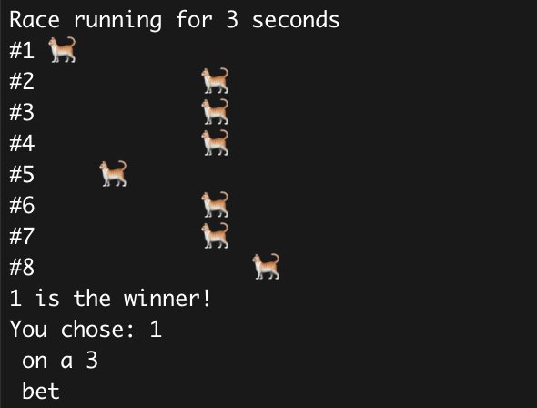

# Terminal-based betting simulation game written in Rust



# Getting Started

`cargo run` or download the relevant releases

# Market Types

- Parimutuel/Tote
- Fixed odds
- Spread

# Bet Types

## Standard Parimutuel
https://en.wikipedia.org/wiki/Parimutuel_betting

- Single Event
  - Win (Pick 1 -> 1st)
  - Place (Pick 1 -> 1st or 2nd)
  - Show (Pick 1 -> 1st or 2nd or 3rd)
  - Exacta (Pick 2 in order -> 1st and 2nd)
  - Trifecta (Pick 3 in order -> 1st, 2nd and 3rd)
  - Trio (Pick 3 any order -> 1st, 2nd, and 3rd)
- Multiple Events
  - Daily Double (Pick 2 -> 1st over any successive events)
  - Running Double (Pick 2 -> 1st over consecutive events)
  - Quadrella (Pick 4 -> 1st over events)
  - Pick6 (Pick 6 -> 1st over consecutive events)

## Standard Fixed Odds
https://en.wikipedia.org/wiki/Fixed-odds_betting

Single Event
  - Win
  - Place

## Spread (WIP)

## Custom

Custom bet types are built through the console input when placing a bet that doesn't match the options above.
- Selection (selections <= total)
- Ordering (If a bet outcome is based on ordering of selections)
- Flexible (Should this bet be a flexible bet eg. Exacta -> Show)
- Event Count (Number of independent events this occurs over)

# Config, Probability, Odds and Randomisation

## Configuration

The simulation was built with repeatability, predictability and similarity to real-life in mind.

There are a number of configurable options:
- Complete randomisation (Initial seed is optional)
- Randomisation of outcomes based on a tuned parameters for a distribution (eg. normal, beta, gamma)

## Probability Calculation

Where:
``` 
n = outcomes
r = selections
```

Combinations (Non-ordered selections):

eg. Trio (Pick 3 in any order)

```
n! / r!(n-r)!
```

Permuations (Ordering selections):

eg. Trifecta (Pick 3 in order)

```
n! / (n-r)!
```